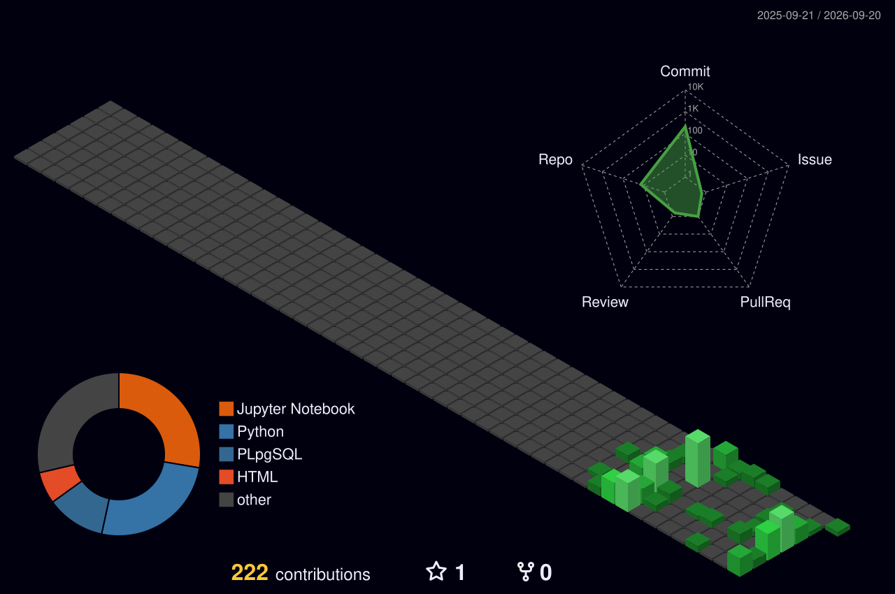

<div align="center">


### **`Engineering Intelligence, One Model at a Time.`**

<p>


</p>

<p>
<a href="https://www.linkedin.com/in/suryanshsingh-codes/">

</a>

<a href="mailto:suryanshsingh.codes@gmail.com">

</a>

<a href="https://github.com/suryanshsingh-codes">

</a>

<a href="https://drive.google.com/file/d/1oH6sz9ef0o60dLif1eYyuJAVXGlfYWhj/view">

</a>
</p>

<br>


</div>

---


# 💫 About Me

```python
class SuryanshSingh:

    def __init__(self):
        self.role = "AI Engineer"
        self.education = "B.Tech CSE • 2028"
        self.location = "Roorkee, India"

        self.completed = [
            "Python",
            "SQL & PostgreSQL",
            "Machine Learning",
            "Natural Language Processing",
            "Streamlit"
        ]

        self.learning = [
            "Deep Learning",
            "Computer Vision",
            "Backend Development",
            "MLOps",
            "System Design"
        ]

        self.goal = "Building Production Ready AI Systems."


me = SuryanshSingh()
```

---

# 👨‍💻 Tech Arsenal

<div align="center">

<table>

<tr>

<td align="center" width="25%">

### 👨‍💻 Languages


<br><br>


</td>

<td align="center" width="25%">

### 🗄️ Databases


<br><br>


</td>

<td align="center" width="25%">

### 🤖 AI & ML


</td>

<td align="center" width="25%">

### 📊 Visualization


</td>

</tr>

<tr>

<td align="center">

### 💬 NLP


</td>

<td align="center">

### 🌐 Frameworks

<p align="center">


</p>
</td>
<td align="center">

### 🛠️ Development


<br><br>


</td>

<td align="center">

### 🚀 Currently Learning


</td>

</tr>

</table>

</div>

---


#  Featured Projects

<div align="center">

<table>
<tr>

<td width="50%" valign="top">

### ❤️ Heart Disease Prediction
ML classification project predicting heart disease with Streamlit app.

✔ Data Preprocessing | EDA | Feature Engineering  
✔ Classification Model | Streamlit App

**Tech:** Python • Pandas • Scikit-learn • Streamlit

[](https://github.com/suryanshsingh-codes/MachineLearning/blob/main/heartDiseaseApp.py)
[](https://github.com/suryanshsingh-codes/MachineLearning/blob/main/Project7ofML_HeartDiseaseApp.ipynb)

</td>

<td width="50%" valign="top">

### 💬 NLP Emotion Classifier
Text emotion detection using NLP & ML techniques.

✔ Text Preprocessing | TF-IDF | Bag of Words  
✔ Logistic Regression | Streamlit App

**Tech:** Python • NLTK • Scikit-learn • Streamlit

[](https://github.com/suryanshsingh-codes/NLP/blob/main/app.py)
[](https://github.com/suryanshsingh-codes/NLP)

</td>

</tr>
<tr>

<td width="50%" valign="top">

### 🚗 Car Price Prediction
Regression model for car price estimation.

✔ Data Analysis | Feature Engineering  
✔ Regression Models | Model Evaluation

**Tech:** Python • Pandas • NumPy • Scikit-learn

[](https://github.com/suryanshsingh-codes/MachineLearning/blob/main/Project3OfML.ipynb)

</td>

<td width="50%" valign="top">

### 🏥 Insurance Cost Prediction
Medical insurance cost estimation using regression.

✔ Data Cleaning | EDA  
✔ Regression Modeling | Evaluation

**Tech:** Python • Pandas • NumPy • Scikit-learn

[](https://github.com/suryanshsingh-codes/MachineLearning/blob/main/Project5OfMLinsurance.ipynb)

</td>

</tr>
</table>

</div>

---


#  GitHub Analytics

<div align="center">

<br>


<!-- Summary Cards -->
<p align="center">

</p>

<p align="center">


</p>

<!-- Streak -->


<br><br>

<br>
<!-- Metrics Dashboard -->
<p align="center">

</p>
</div>

---


# 📊 Contribution Activity

<div align="center">

<!-- 3D Contribution Graph -->


<br><br>

<!-- Activity Graph -->


<br><br>

<!-- Contribution Snake -->


</div>

---


# 🏆 Certifications

<div align="center">

<table>

<tr>

<td align="center" width="50%">

🥇

### Machine Learning

**Mind Luster**

</td>

<td align="center" width="50%">

🐍

### Python

**Mind Luster**

</td>

</tr>

<tr>

<td align="center">

📊

### NumPy • Pandas • Statistics

**Mind Luster**

</td>

<td align="center">

💼

### Deloitte Data Analytics

**Job Simulation**

</td>

</tr>

</table>

</div>

---


<div align="center">


## ⭐ Thanks for Visiting!

**Learning today. Building tomorrow.**

### Artificial Intelligence • Machine Learning • NLP • Python • SQL


</div>
